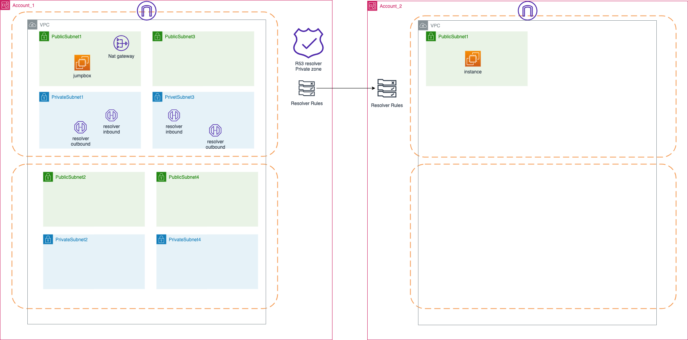

# Demo cross account R53 resolver sharing
## Architecture

## Deploy
```
git clone https://github.com/xxradar/AWS_R53_sharing_x-account.git
```
```
cd ./tf
```
```
cp terraform.tfvars.example terraform.tfvars
```
Update terraform.tfvars with access_key and secret_key
```
terraform init
```
```
terraform apply
```
## Prerequisite
```
rm -rf ./key.pem
terraform output -raw private_key >key.pem
chmod 400 ./key.pem
```

## DNS testing
```
ssh -i ./key.pem ubuntu@<jumpbox>
```
```
dig www.radarhack.com
...
dig demo.radarhacker.com  #DNS forward to DigitalOceans hosted zone
...
dig testing.radarhacker.com  #DNS forward to DigitalOceans hosted zone
...
dig my-instance.demo-radarhack.internal #r53 internal zone
```

## Check invite on shared account
Invite should be send to other account.

## DNS testing on shared account
Accepting the share invite
```
#!/bin/bash

export AWS_ACCESS_KEY_ID=xxxxx
export AWS_SECRET_ACCESS_KEY=xxx
export AWS_DEFAULT_REGION=eu-west-3
export VPCID=xxxxxx

#accept the resourceShareInvitations
export ARN=$(aws ram get-resource-share-invitations | jq -r .resourceShareInvitations[].resourceShareInvitationArn)
aws ram  accept-resource-share-invitation  --resource-share-invitation-arn $ARN

# associate resolver rule with vpc-id
export ID=$(aws route53resolver  list-resolver-rules | jq -r '.ResolverRules[] | select(.Name == "playground-radarhacker") | .Id')
aws route53resolver  associate-resolver-rule --resolver-rule-id $ID --vpc-id $VPCID
```

The other account can access
```
dig www.radarhack.com
...
dig demo.radarhacker.com  #DNS forward
...
dig testing.radarhacker.com  #DNS forward
...
dig my-instance.demo-radarhack.internal # not configured r53 internal zone ... adding a rule to inbound endpoints will solve
```
## TODO
- tf for automation of shared account
- add a selection criteria for ResolverRules id
```
aws route53resolver  list-resolver-rules | jq -r '.ResolverRules[] | select(.Name == "playground-radarhacker") | .Id'
```
